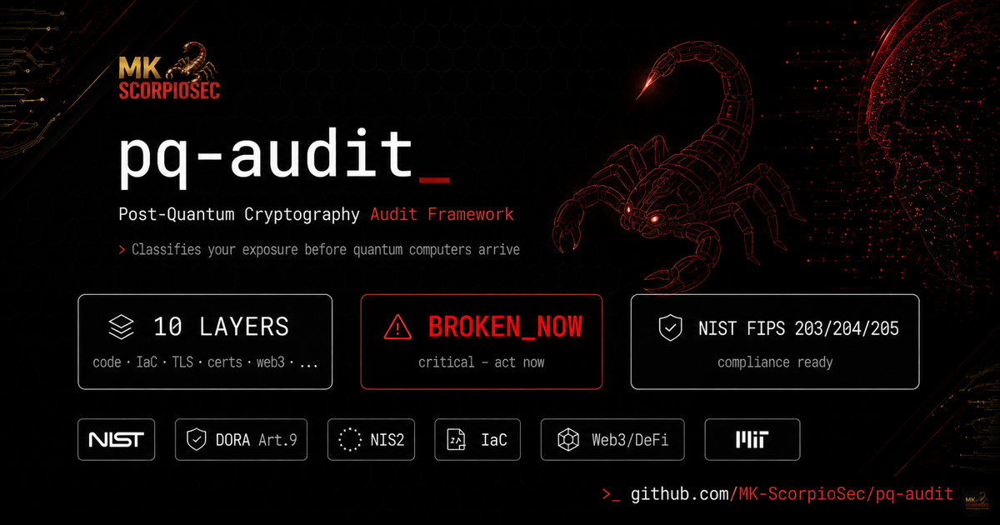
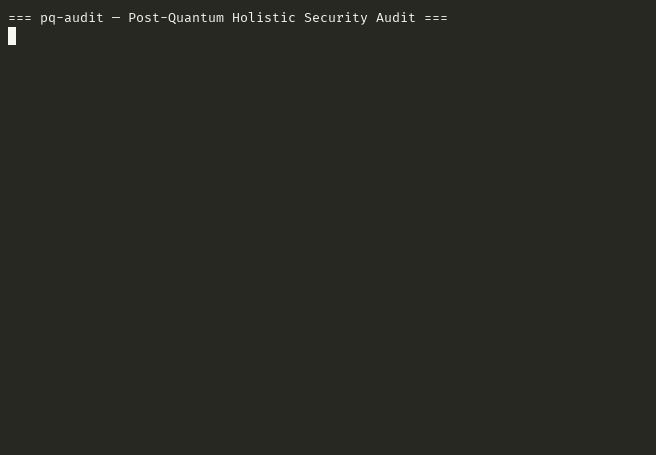

# pq-audit

<p align="center">

<br><sub>Banner generated with AI assistance · MK ScorpioSec</sub>
</p>

**Post-Quantum Holistic Security Audit**

[](LICENSE)
[](https://www.python.org/)
[](https://github.com/mk-scorpiosec/pq-audit/actions/workflows/security-scan.yml)

A multi-layer security audit framework that evaluates cryptographic posture, infrastructure configuration, and code against NIST PQC standards (FIPS 203/204/205) — from today's broken algorithms to post-quantum readiness.

*I don't hunt threats. I am the threat.*

---

## Overview

`pq-audit` examines your stack across 10 layers and classifies findings into three risk tiers:

| Risk | Meaning |
|------|---------|
| `BROKEN_NOW` | Cryptography broken today (TLS 1.0/1.1, MD5, SHA-1, weak RSA) — fix immediately |
| `SNDL_VULNERABLE` | Secure Now, Decrypt Later — data safe today but harvestable for future quantum decryption |
| `PQC_READY` | Already using quantum-resistant primitives |

### Audit Layers

| Layer | What It Checks |
|-------|---------------|
| `code` | Python source — cipher imports, key sizes, hash functions, TLS config |
| `cloud` | IaC (Terraform/CloudFormation) — encryption flags, TLS policy, key management |
| `deps` | `requirements.txt`, `pyproject.toml` — cryptographic library versions |
| `config` | `nginx.conf`, `apache2.conf`, `sshd_config`, `openssl.cnf` — protocol/cipher suites |
| `certs` | X.509 certificates — algorithm, key size, validity, SAN coverage |
| `network` | Live TLS handshake — negotiated protocol, cipher, HSTS, OCSP |
| `containers` | Dockerfile, docker-compose — base image crypto, env var leaks |
| `api` | REST/gRPC endpoint responses — TLS version, header security, auth schemes |
| `compliance` | Cross-layer gap analysis against NIST SP 800-131A, DORA, NIS2 |
| `web3` | DeFi/blockchain off-chain components — ECDSA secp256k1, JWT ES256K, JSON-RPC endpoints, CBOM generation |

---

## Demo



---

## Installation

**Requirements**: Python 3.10+ | Zero external dependencies for core layers

```bash
# Option 1: Clone and run directly (no install needed)
git clone https://github.com/mk-scorpiosec/pq-audit.git
cd pq-audit
python3 pq_audit.py --help

# Option 2: Install optional dependencies for enhanced scanning
pip install cryptography paramiko requests  # enables more detection methods
```

**No pip install required** — `pq_audit.py` is a single-file script with zero mandatory external deps.

---

## Quick Start

```bash
# Scan source code for weak crypto
python3 pq_audit.py --layer code --target ./my-project/

# Audit TLS configuration of a live host
python3 pq_audit.py --layer tls --host example.com --port 443

# Check IaC (Terraform/CloudFormation) posture
python3 pq_audit.py --layer cloud --target ./terraform/

# NEW: Audit DeFi/blockchain off-chain endpoints (Immunefi-ready)
python3 pq_audit.py --layer web3 --host api.defi-protocol.example.com

# Run all 10 layers against a full project
python3 pq_audit.py --layer all --target ./repo/ --host myapp.example.com

# JSON output for SIEM/pipeline integration
python3 pq_audit.py --layer tls --host example.com --json > findings.json
```

## Example Output

```
{
  "findings": [
    {
      "layer": "SYSTEM",
      "risk": "BROKEN_NOW",
      "description": "TLS 1.0/1.1 enabled — broken by classical standards today",
      "file": "azure/app_service.tf",
      "line": 29
    },
    {
      "layer": "WEB3",
      "risk": "SNDL_VULNERABLE",
      "description": "secp256k1 — ECDSA curve used in Ethereum. Quantum-vulnerable (CNSA 2.0: migrate by 2030)",
      "immunefi_relevance": "Off-chain API with quantum-vulnerable ECDSA signatures"
    }
  ],
  "remediation_plan": {
    "immediate_actions_broken": { "deadline": "30 days", "count": 1 },
    "short_term_sndl": { "deadline": "6-12 months", "count": 1 }
  }
}
```

---

## Usage

```bash
# Scan Python source code
python pq_audit.py --layer code --target ./src

# Scan Terraform IaC
python pq_audit.py --layer cloud --target ./terraform

# Scan TLS configuration files
python pq_audit.py --layer config --target /etc/nginx

# Full audit (all layers)
python pq_audit.py --layer all --target . --output report.json

# CI mode — exit 1 on BROKEN_NOW findings
python pq_audit.py --layer code --target . --ci --fail-on BROKEN_NOW
```

---

## Output

```json
{
  "summary": {
    "target": "./terraform/aws",
    "layer": "cloud",
    "by_risk": {
      "BROKEN_NOW": 1,
      "SNDL_VULNERABLE": 1,
      "PQC_READY": 0
    }
  },
  "findings": [
    {
      "file": "app_service.tf",
      "line": 29,
      "risk": "BROKEN_NOW",
      "finding": "Minimum TLS version set to 1.0 — broken protocol",
      "mitre": "T1040",
      "remediation": "Set minimum_tls_version = \"1.2\" or \"1.3\""
    }
  ]
}
```

---

## FP Triage Pipeline

`triage.py` — validate findings against a RAG knowledge base before reporting:

```bash
# Scan
python3 pq_audit.py --layer cloud --target ./terraform --output findings.json

# Triage: classify each finding as TRUE_POSITIVE / NEEDS_REVIEW / LIKELY_FP
python3 triage.py --input findings.json --output triage_report.json --context ./terraform
```

The triage pipeline uses semantic search against a local Qdrant knowledge base to corroborate findings. Context-aware: `/test/`, `/demo/`, `/lab/` paths score as LIKELY_FP; `/prod/`, `/main/`, cloud provider paths score as TRUE_POSITIVE.

---

## Research

**Series #1 — TerraGoat** ([bridgecrewio/terragoat](https://github.com/bridgecrewio/terragoat)): 4 pq-audit findings on Bridgecrew's deliberately vulnerable Terraform repo. Trivy found 243 findings on the same codebase — zero crypto/TLS overlap. Results: [mk-scorpiosec/research](https://github.com/mk-scorpiosec/research).

---

## NIST Alignment

| Standard | Coverage |
|----------|---------|
| NIST FIPS 203 (ML-KEM / Kyber) | Key encapsulation readiness check |
| NIST FIPS 204 (ML-DSA / Dilithium) | Digital signature algorithm audit |
| NIST FIPS 205 (SLH-DSA / SPHINCS+) | Hash-based signature detection |
| NIST SP 800-131A | Deprecated algorithm identification |
| DORA / NIS2 | Cryptographic control gap analysis |

---

## Security

See [SECURITY.md](SECURITY.md) for vulnerability reporting.

---

## License

Apache 2.0 — see [LICENSE](LICENSE).

---

<div align="center">
<sub>MK ScorpioSec — AI-Native Security Operations</sub>
</div>
